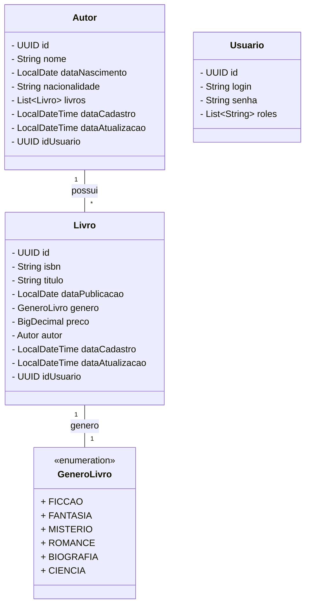

# Meu Projeto

Este projeto demonstra o uso de classes `Autor`, `Livro` e `Usuario` para gerenciar informações de uma biblioteca.

## Diagrama de Classes

```mermaid
classDiagram
    class Autor {
        - UUID id
        - String nome
        - LocalDate dataNascimento
        - String nacionalidade
        - List~Livro~ livros
        - LocalDateTime dataCadastro
        - LocalDateTime dataAtualizacao
        - UUID idUsuario
    }
    class Livro {
        - UUID id
        - String isbn
        - String titulo
        - LocalDate dataPublicacao
        - GeneroLivro genero
        - BigDecimal preco
        - Autor autor
        - LocalDateTime dataCadastro
        - LocalDateTime dataAtualizacao
        - UUID idUsuario
    }
    class Usuario {
        - UUID id
        - String login
        - String senha
        - List~String~ roles
    }
    class GeneroLivro {
        <<enumeration>>
        + FICCAO
        + FANTASIA
        + MISTERIO
        + ROMANCE
        + BIOGRAFIA
        + CIENCIA
    }

    Autor "1" -- "*" Livro : possui
    Livro "1" -- "1" GeneroLivro : genero
```
